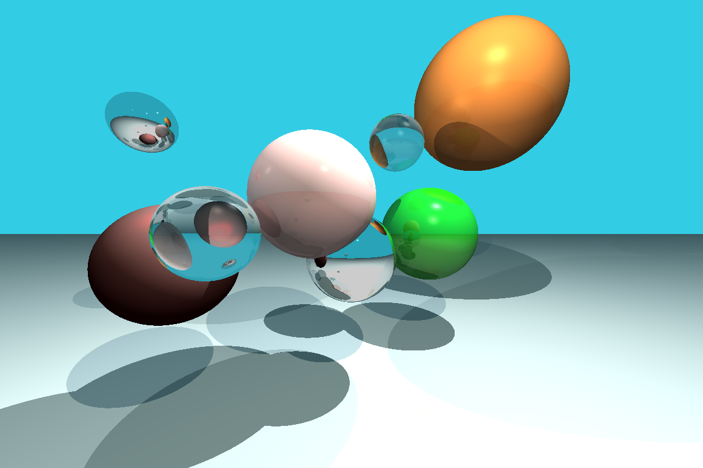

# Ray Tracer

This is a small side project I did over a weekend. Ray Tracing itself is done in raw C++ (no libraries) and is rendered with SFML to a window and an image file. This implementation primarily uses Phong reflection model in combination with recursive reflections and refractions.

I wanted this project to be small and fun, which is why this Ray Tracer does not aim at physical accuracy or high-performance (in fact there are quite a few places in code where I favored clarity over performance). Rather oddly, I also wanted this project to be educational for myself and other people looking through the code, which is why I left comments explaining different stages of the algorithm, as well as links to sources that I used to implement it.

I plan to add more features to this in the future, such as more objects, 3D meshes, texture mapping, procedural texture generation, various improvements to color mixing, and general optimizations.